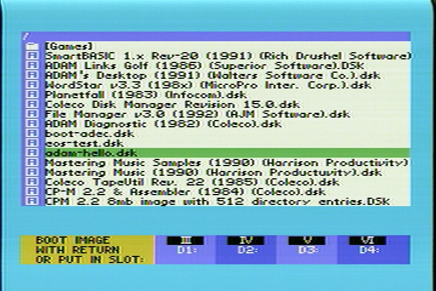
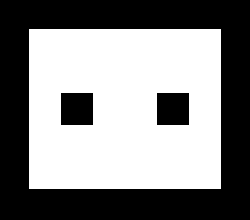
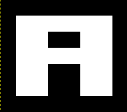

# VHS HEAD

For Coleco Adam users with Adamnet Disk Emulator (ADE) devices.

VHS Head is a boot menu and configuration program for ADE (Pro and Lite) users. It replaces the boot.dsk on your ADE device, and provides an attractive user interface to select, boot, and manipulate disk images, modelled after the SmartKeys UI present in Coleco applications such as SmartWriter. To increase readability and maximize the amount of data which can be displayed on-screen, a proportional font based on the embedded SmartKeys font found in the SmartWriter ROM, was extended with a full ASCII character set.

## Installing

To install, simply download the latest boot.dsk from the Releases, and place it in the root [/] directory of your ADE's disk card, replacing any boot.dsk program that may already be there.

## The Screen



VHS Head divides the screen into three main areas:

* The directory view, with the current directory on the top most line, and 17 entries of the directory at a time.
* The input/output section, where user input is done, or user output is displayed.
* The SmartKeys section, where available smartkeys and status messages are displayed.

## Keys

VHS Head is controlled with the various SmartKeys present on the keyboard, as seen in the following table.

| Key | Description
|---  |---
| III | Mounts the currently selected image into Drive 1 (EOS Device 4). Hold SHIFT to display the currently mounted filename in the output area.
| IV  | Mounts the currently selected image into Drive 2 (EOS Device 5). Hold SHIFT to display the currently mounted filename in the output area.
| V   | Mounts the currently selected image into Drive 3 (EOS Device 6). Hold SHIFT to display the currently mounted filename in the output area.
| VI  | Mounts the currently selected image into Drive 4 (EOS Device 7). Hold SHIFT to display the currently mounted filename in the output area.
| ESCAPE/WP | Exits back to SmartWriter
| WILD CARD | Show Help. Holding SHIFT will bring up the settings menu.
| UP | Move cursor up. Will devance to the previous page, if already at the top, and place the cursor at the bottom. Holding SHIFT will immediately devance to the previous page.
| DOWN | Move cursor down. Will advance to the next page, if already at the bottom, and place the cursor at the top. Holding SHIFT will immediately advance to the next page.
| HOME | Place the cursor on the very first entry in the directory, moving back to the first page, if necessary. Holding SHIFT will move back to the first page of the root directory.
| INSERT | Create new directory, disk, or tape in the current folder. Holding SHIFT will format the currently selected file.
| DELETE | Delete the currently selected directory, disk, tape, or ROM. Confirmation is asked.
| PRINT | Print the current directory on the SmartWriter printer, displaying each entry as it is sent to the printer.
| CLEAR | Clear a disk slot, or all slots.
| MOVE | Select the current file to be moved, onto the clipboard.
| COPY | Select the current file to be copied, onto the clipboard.
| STORE | Put the file currently on the clipboard, into the current directory.
| GET | Rename the currently selected file.

## Navigating the directory

When VHS Head starts, it will read the current directory, and display the first 17 entries on screen. If the ADE has been reset, the root directory will be displayed, otherwise, the last directory viewed will be shown.

**note** Joystick movements and button presses from either controller are accepted.

A cursor bar shows the currently selected file. It can be moved using either the arrow keys, or the joystick. If the cursor moves beyond the last visible entry, and there are more entries to display, then the next page will be displayed, and the cursor bar will be placed at the top of the display. If the cursor is at the first visible entry, and an attempt is made to move further up, and there is a previous page, the previous page will be displayed.

### Quickly navigating between pages

Pressing CONTROL while using either the arrow keys, or pressing the right button while moving the joystick will either devance the page, if pressed UP, or advance the page, if pressed down.

## Icons

Each file shows a corresponding icon, indicating its file type:

| Icon                                      | Description
|---                                        |---
|   | DDP Digital Data Pack
|  | Disk Image File
|   | ROM Cartridge File

## The RETURN key

If a directory is selected with the return key, the selected directory is mounted, read, and displayed, starting with its first page.

If a disk or tape is selected, the selected disk or tape is mounted in drive 1 (EOS Device 4), and the system is booted into the selection. This assumes that the selected disk or tape can boot. Otherwise, the Adam will boot into SmartWriter(tm)

If a ROM file is selected, it will be converted by the ADE into a bootable format, and the system booted. If the ROM is larger than 32K (32,768 bytes), then only the first 32K (32,768 bytes) are loaded.

## Mounting an image into a specific drive

Pressing one of the III, IV, V, or VI keys, will mount the currently selected image into the desired virtual drive on the ADE.

| Key | Description
|---  |---
| III | Mount into Drive 1 (EOS Device 4)
| IV  | Mount into Drive 2 (EOS Device 5)
| V   | Mount into Drive 3 (EOS Device 6)
| VI  | Mount into Drive 4 (EOS Device 7)

A confirmation status message will be shown, and subsequently return to the main part of the program.

## Clearing a Drive slot

Pressing the CLEAR key, will present the following SmartKeys, to ask which drive slot(s) to clear:

| Key | Description
|---  |---
| II  | Clear ALL four drive slots.
| III | Clear Drive 1
| IV  | Clear Drive 2
| V   | Clear Drive 3
| VI  | Clear Drive 4

A confirmation message will be shown if one of these keys are pressed. Pressing any other key will abort the operation.

## Creating a New file

Pressing the INSERT key will immediately ask for a file type, showing one of three possible types:

| Key | Description
|---  |---
| IV  | DIR - Create a Directory (folder) that can hold other files.
| V   | DISK - Create a Disk
| VI  | DDP - Create a Digital Data Pack (256K)

Any other key will abort the operation.

### DIR

Creating a folder will simply ask for the name of the folder. Pressing ESCAPE will abort the operation. Pressing RETURN will create the folder, and display an affirmative message, along with an appropriate tone.

### DDP

Creating a DDP will simply ask for the name of the new data pack. As it says, do not provide an extension, as one will be provided for you automatically. The size of a DDP is always 256 blocks, or 256K.

### DISK

For disks, the SmartKeys will select the following:

| Key | Description
|---  |---
| II  | 160K Single Sided/Double Density disk, 40 tracks.
| III | 320K Double Sided/Double Density disk, 40 tracks.
| IV  | 640K Double Sided/Quad Density disk, 80 tracks.
| V   | 1440K Double Sided/High Density disk, 80 tracks.
| VI  | Custom (specify # of blocks)

If custom is selected, a status message asking for the # of desired blocks. You can specify  any number from 1 to 16383. Each block is 1024 bytes, allowing for a maximum image size of 16 megabytes (16,776,192 bytes). If RETURN is presed, the image is created along with an affirmative message. If ESCAPE is pressed, the operation is aborted.

## Formatting a file

Formatting a file will clear it of all data. It will still need to be mounted and formatted by the appropriate operating system (EOS or CP/M / T-DOS) before use, as this only clears the image, and does not apply a file system.

Press V to confirm the operation, VI or any other key to abort.

If the operation is confirmed, then the file is formatted, and an affirmative message is displayed.

## Deleting a file

Pressing DELETE will delete the currently selected file from the SD card, after affirmative confirmation.

Press V to confirm the operation, VI or any other key to abort.

If the operation is confirmed, the file is deleted, an affirmative message is displayed, and the directory is re-loaded, starting from the first page.

## Renaming a file

Pressing the WILD CARD key will rename the currently selected file. VHS Head will ask you for the new file name. Pressing ESCAPE will abort the operation, while pressing RETURN will rename the file, display an affirmative message, and refresh the directory display back to the first page.

## Printing The Directory

Pressing the PRINT key will display a status message indicating that the directory is being printed; then send a list of the current directory to the SmartWriter printer, displaying each entry in the input/output section of the screen as it is printed. Once done, the input/output area of the screen will clear, and the SmartKeys display will return. 

Pressing VI will abort the operation.

## Using the Cut, Copy, and Paste commands

The Cut, Copy and Paste commands are mapped to the following SmartKeys:

| Key   | Description
|---    |---
| MOVE  | Cut
| COPY  | Copy
| STORE | Paste

MOVE will put the selected file onto the clipboard. You can then navigate to another folder and press STORE to move the file to the current folder. The original file is erased. An affirmative message will be displayed, and an affirmative tone will be played. 

COPY will put the selected file onto the clipboard. You can then navigate to another folder and press STORE to make a copy of the file to the current folder. The original file is preserved. An affirmative message will be displayed, and an affirmative tone will be played.

STORE will complete the MOVE or COPY. If a file hasn't been previously selected, then a negative tone and message will be heard and displayed, indicating that a MOVE or COPY should be done first.

## Why is this called "VHS Head" ?

It needed a name, and ADE made me think of Ade Blacow, who records electronic music under the name VHS Head. His music is in the spirit of musique-concrete, assembled from old VHS tapes of TV shows and movies, in a manner reminicent of The Art of Noise. He hails from Blackpool, UK.

soundcloud: https://soundcloud.com/vhs-head
twitter: https://twitter.com/vhs_head

## Building from Source

You will need:

* A copy of Z88DK (http://z88dk.org/), unpacked and ready to go. Versions as of 2021-07-31 have the requisite appmake that can make DDP images.
* eoslib, to provide the EOS bindings, (http://github.com/tschak909/eoslib) eos.lib installed into $Z88DK/lib/clibs, and eos.h installed into $Z88DK/include
* smartkeyslib, to provide the user interface, (http://github.com/tschak909/smartkeyslib) smartkeys.lib installed into $Z88DK/lib/clibs, and smartkeys.h installed into $Z88DK/include

Once these are installed, change to where you checked out vhs-head, ensure Z88DK's environment is loaded, and type:

```
make
```

If everything works as expected, a boot.ddp will be created that you can copy to your ADE.

## Acknowledgements

* Sean Myers made the AdamNet Drive Emulator firmware.
* COLECO, Adam, and SmartWriter were trademarks of Coleco Industries.
